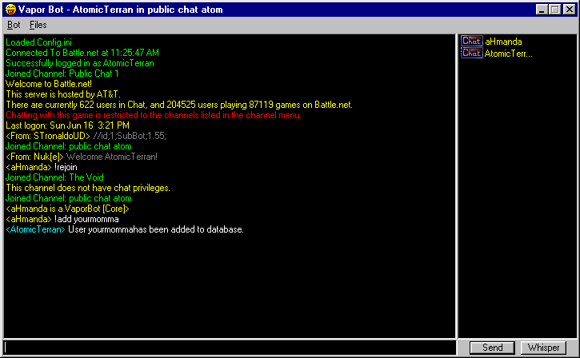



## An Updated\!\!\! Much Better Battle\.net Bot

### Description

This update uses a Config.ini to save username and password. I also have added a userdatabase with some chat commands. Have fun with this update and keep learning Newbs! Please leave feedback.
 
### More Info
 
Pure-Leetness

             |
---                |---
**Submitted On**   |2002-03-01 21:51:16
**By**             |[Adam Bleech](https://github.com/Planet-Source-Code/PSCIndex/blob/master/ByAuthor/adam-bleech.md)
**Level**          |Intermediate
**User Rating**    |4.4 (31 globes from 7 users)
**Compatibility**  |VB 5\.0, VB 6\.0
**Category**       |[Internet/ HTML](https://github.com/Planet-Source-Code/PSCIndex/blob/master/ByCategory/internet-html__1-34.md)
**World**          |[Visual Basic](https://github.com/Planet-Source-Code/PSCIndex/blob/master/ByWorld/visual-basic.md)
**Archive File**   |[An\_Updated951906162002\.zip](https://github.com/Planet-Source-Code/adam-bleech-an-updated-much-better-battle-net-bot__1-32251/archive/master.zip)

